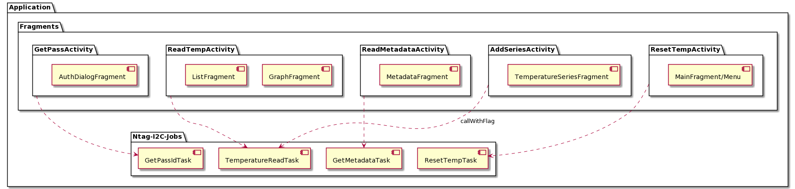

= NFC Temperature Reading App

== Version Info
* minSdkVersion: 15
* targetSdkVersion: 27
* Java-Version: 8
* SDK-Build-Tools-Version: 29.0.2
* GraphView-Version: 4.2.2

== 1 application structure

=== 1.1 activities
==== 1.1.1 MainActivity
The main activity contains the tab view to switch between all fragments. Furthermore, it gives access to the menu, that triggers the ReadTempActivity, the ResetActivity or the GetPassActivity (authentication). This global access ensures that data measurement can be measured regardless of the active fragment. The new data point gets added to the ListFragment and GraphFragment simultaneously. 

==== 1.1.2 ReadTempActivity
This activity reads the current temperature of the sensor. It uses the Ntag_I2C_Jobs class that defines a specific subclass for this task. Within this job, the following additional processes are getting called (see 2.1.1 for ndef record specifications):

* increase the payload of the ct-record
* extend payload of md-record
* write temperature values to internal device memory

==== 1.1.3 ResetActivity
The ResetActivity removes all measured temperatures from the device storage. On the tag it restores the default NdefMessage with a ct-record of 0 and no md-record. Due to the fact that the default message always uses less bytes than the one to be removed, some old data might stay in the storage until it gets overwritten. This old data is not part of the new NDEF message hence it doesn't corrupt the application state.

==== 1.1.4 ReadMetadataActivity
If a tag gets discovered, the application reads out the md-Record of the NDEF message. Due to the specification (see table below) that one (uid-timestamp)-pair is 11 Bytes long, the record payload gets splitted up in order to create the view. 6 Bytes are used by the mac address, 5 bytes are used by the timestamp that has the format 010101111111 for 01.01.2001 - 11:11:11. Thus every 11 bytes belong to one record. 

=== 1.1.5 GetPassActivity
This activity is called if the user submits the dialog of the AuthDialogFragment. It starts the GetPassIdTask to get the hashed password from the tag memory and compare it to the inserted one.

=== 1.2 fragments
==== 1.2.1 ListFragment 
The list fragment lists all temperatures that have been measured. Additionally, it shows a timestamp for each measurement.

==== 1.2.2 GraphFragment
The graph fragment plots all measured temperatures in a line graph. Therefore it uses the GraphView library.

==== 1.2.3 TemperatureSeriesFragment
This fragment allows the user to measure and plot the temperature in real time, given an interval size in miliseconds. The data doesn't get stored during the measurement to increase the performance. The fragment triggers the ReadTempActivity with a flag that prevents the additional writing processes.

==== 1.2.4 MetadataFragment
In the metadata fragment the user has either the option to read out all metadata that is stored on the tag or just those belonging to the current device. The fragment triggers the ReadMetadataActivity.

==== 1.2.5 AuthDialogFragment
This fragment provides the functionality to enter a password. It is a dialog that appears if the called option requires an authentication. 

== 2 memory, data exchange & authentication
=== 2.1 memory access
==== 2.1.1 NDEF
The Ntag memory stores metadata relating to the measurements. To access the memory via NFC in Android, the NDEF-Format is used. Hence the tag contains a single NDEF message with three TXT-records having the following ids.

* ps: This record stores the hashed pass_id. (SHA256)
* ct: This record stores the amount of temperature measurements
* md: This record stores the metadata of the measurements. It consists of a unique id of the app (i.e the mac address of the phone) and a timestamp of the measurement. There is only one md-record whose payload gets extended in order to save memory.

Additional to the three TXT-Records the tag contains one AAR-Record that hasn't an id. It contains the package name to ensure that the app will be started if a tag has been detected.

==== 2.1.2 memory management
In order to store as much metadata on the tag as possible, the following determinations has been made:

|===
|Record |Bytes ID | Bytes Payload | total

|PS
|4
|45
|49

|AAR
|0
|34
|34

|CT
|4
|4
|8

|MD
|4
|11 * #measurements
|4 + 11 * #measurements

|===

Considering the table above, a total EEPROM memory of 2kByte and a reservation of 10 Bytes for padding, the metadata of 176 measurements can be stored. 

==== 2.1.3 temperature sensor
If the tag has a connection to a NFC reader (i.e the phone), it powers the chip and the temperature sensor. The value of the sensor gets written into the SRAM-memory in real time. 

==== 2.1.4 temperature values
Once a temperature has been read out of the SRAM, it gets written to the internal storage of the phone. (path: /data/data/com.ferit.temp_reader/files/temperatures/temperatures.json). The ListFragment, the GraphFragment read out the data when they create their view. Additionally, the MD-record will be extended for this measurement and updated on the tag. The TemperatureSeriesFragment only reads out the existing data if the user has chosen this particular option.

=== 2.2 authentication
If the user chooses the authenticate option in the app menu or tries to read out the temperature or metadata for the first time, he will be asked to type in the chip password. +
*password: pass157* +
The password gets hashed with the SHA256 algorithm. The related salt value needs to stay the same and is stored in the SHA256Encryptor class. Both hashes, the one of the typed password and the one in the EEPROM memory (payload of the PS-record) of the tag will get compared. If they are the same, the user is authenticated and can perform every action during the app session.
Authentication is required for the following operations:

* Read out a new temperature
* Start a new temperature series
* Read out all metadata from the tag

== 3 Issues
* *increasing measurement time* +
If a new temperature has been measured, the payload of the MD-record gets extended. To update a new record, the whole NDEF message has to be read out, modified and written back as the NDEF-Android library doesn't provide a function to append data to an existing message or record. With the increasing number of measurements, the payload of the MD-record increases as well as the size of the message. It takes more time to write the message to the chip which results in a longer measurement time.
